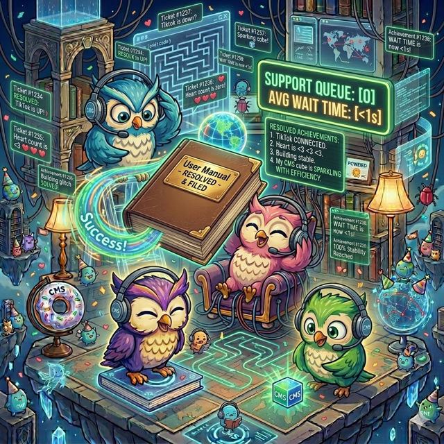

# Owlet CMS

**Knowledge that connects.**

Owlet is an open-source content management system designed specifically for **libraries, archives, museums, and community knowledge spaces**.

Many community institutions rely on outdated, fragile, or overly complex website systems. Owlet aims to provide a **modern, approachable, and extensible CMS** that helps organizations share knowledge with their communities without needing a full technical team.

Owlet is being built with a simple idea in mind:

> Knowledge is most powerful when it connects people, stories, places, and resources.

---

# 🌱 Why Owlet Exists

Public libraries and community institutions are among the most important knowledge stewards in the world. Yet many operate with:

* limited budgets
* minimal technical staff
* aging web infrastructure
* software designed for marketing instead of knowledge sharing

Owlet is an attempt to build a **friendly, open platform** for these organizations.

Instead of focusing on advertising, analytics, or corporate marketing workflows, Owlet focuses on the kinds of interactions that libraries actually support:

* events and community programs
* local history collections
* resource discovery
* public engagement through forms and feedback
* knowledge relationships between people, places, and materials

The goal is simple:

> Help someone visit a library website and say: **“I found exactly what I needed.”**

---

# 🧭 Project Vision

Owlet is intended to become a **community knowledge platform**, not just a website builder.

Key ideas guiding the project:

### Knowledge that connects

Content should not exist as isolated pages. Owlet will support relationships between:

* people
* places
* events
* collections
* documents
* resources

This allows institutions to create **living knowledge networks** rather than static pages.

### Friendly software for real humans

Many libraries operate without dedicated developers. Owlet prioritizes:

* simple interfaces
* clear workflows
* accessibility
* minimal configuration

### Open ecosystem

Owlet will support plugins so communities can extend the platform with features such as:

* reading lists
* genealogy archives
* room reservations
* exhibit pages
* makerspace tools
* local history projects

### Built for community institutions

Owlet is designed for:

* public libraries
* rural libraries
* museums
* archives
* historical societies
* community learning spaces

---

# ✨ Core Capabilities (Planned)

Owlet focuses on the features community institutions use every day.

## 📅 Events & Programs

A clean, easy event system designed for:

* storytime
* workshops
* lectures
* community meetings
* classes

Events can connect to resources, collections, and topics.

## 📝 Forms & Community Interaction

Simple forms with optional email receipts for things like:

* program registration
* room reservations
* volunteer sign-ups
* patron feedback

## 📚 Knowledge Collections

Institutions can build collections that bring together related:

* documents
* photos
* people
* places
* resources

## 🧩 Extensible Plugins

Owlet will support plugins that allow contributors to add new capabilities without modifying the core platform.

## 🎨 Library Starter Templates

New installations can start with templates designed for common use cases like:

* small rural libraries
* city public libraries
* historical archives
* arts organizations

---

# 🏗️ Technology Stack

Owlet is being built with reliable, widely-used tools to ensure long-term sustainability.

Backend

* NestJS
* Node.js
* TypeScript

Frontend

* React
* Vite

Database

* PostgreSQL

Infrastructure

* Docker

These tools were chosen to make the project approachable for contributors and easy for institutions to deploy.

---

# 🚀 Development Status

Owlet is in **early development**.

### 🏛️ Core Features *(always included)*

- 🌐 **Public site** — dynamic library branding, theming, and logo
- 🧭 **Editable navigation** — dropdown menus, nested items, mobile-friendly
- 📄 **Pages & Events** — full content management with image uploads
- 🗂️ **Collections** — curated groups linking any content type
- 👥 **Staff Directory** — public profiles with private fields
- 📁 **Media Library** — file management with OCR full-text search
- ⚙️ **Settings & Setup Wizard** — guided first-run configuration
- 🔐 **Role-based auth** — admin, editor, staff, viewer roles
- 🧩 **Plugin system** — auto-discovery, enable/disable, community-extensible

### 🔌 Plugins *(optional, toggle on/off)*

- 📚 **Catalog** — Evergreen ILS integration with nightly sync and new arrivals shelf
- 💻 **Digital Resources** — curated links to databases, ebooks, and online tools

### 🗺️ Roadmap

- [ ] 👤 **Patron accounts** — self-registration, patron portal, reading history
- [ ] 🔄 **Circulation & Holds** — checkout tracking, returns, hold queue, email reminders
- [ ] 📖 **Native cataloging** — built-in catalog for little free libraries and small collections
- [ ] 🚀 **Deployment** — one-command install, managed hosting guidance

Early contributors are welcome.

---

# 💡 Guiding Principles

Owlet follows a few simple principles:

1. **Community first**
   Technology should serve people and institutions that share knowledge.

2. **Simple is powerful**
   Interfaces should be understandable without training.

3. **Open collaboration**
   The project should grow through shared ideas and contributions.

4. **Longevity over trendiness**
   Choose tools that will still be stable and maintainable years from now.

---

# 🧑‍💻 Contributing

Contributions are welcome, especially from people interested in:

* civic technology
* digital libraries
* knowledge systems
* open-source community platforms

Ways to help:

* contribute code
* design UI improvements
* propose plugins
* improve documentation
* share ideas from real library environments

---

# 🌍 The Long-Term Idea

Owlet started as an idea inspired by the needs of a **small rural library looking to modernize its website**.

If successful, the project could grow into a shared platform for community institutions everywhere to build **connected knowledge spaces**.

---

## Stack

- NestJS backend
- React frontend
- PostgreSQL
- Docker

## Development

Start database:

docker compose up

Start backend:

cd backend
npm run start

Start frontend:

cd frontend
npm run dev

---

  
   
  <i>Actual footage of our dev team resolving tickets.</i>

---

# 🦉

**Owlet CMS**
*Knowledge that connects.*
